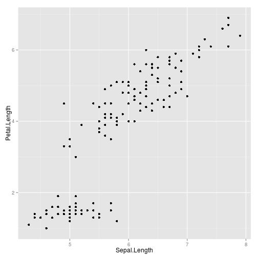

How to visualize insights from data? Part I
========================================================
author: Adomas
date: 2014-11-24

HW solutions & data.table cheatsheet
========================================================

Homework solutions to `data.table` homework could be [found here](https://github.com/adomasb/pres-datatable/blob/gh-pages/solutions.R).

You can always use this [`data.table` cheatsheet](https://s3.amazonaws.com/assets.datacamp.com/img/blog/data+table+cheat+sheet.pdf)

Motivation
========================================================

Let's start with some quoutes:

*"Visualizations act as a campfire around which we gather to tell stories."* -- Al Shalloway

*"The greatest value of a picture is when it forces us to notice what we never expected to see."* -- John Tukey

What is our goal?
========================================================

To be at least better than this dolphin when visualizing insigths


Plan of workshop
========================================================

- What is `ggplot2`?
- Iris dataset
- `qplot`
- Scatter plots
- `geom`s: `boxplot`, `histogram`, `density` & `bar`
- Multiple plots
- Fill & colour
- Homework

What is ggplot2?
========================================================

`ggplot2` - grammar of graphics 2, written by Hadley Wickam, creator of already covered `dplyr`.

`ggplot2` combines best practises and allows sophisticated and yet attractive data visualization of mulitlayered plots, which are nearly impossible to reproduce with base engine.

Dataset
========================================================

We will use classical Iris dataset. Data frame will be converted to `data.table`, which we know already


```r
library(datasets)
library(data.table)
iris <- data.table(iris)
```

Now take a look at data with already known methods.

Quick plot
=========================================================

Install `ggplot2` if you don't have it yet and load it


```r
library(ggplot2)
```

`qplot()` is basic and simple function, very similar to `plot()`.

Basic syntax of `qplot`


```r
qplot(x, y, data, geom)
```

Scatter plot
=========================================================

If we want to plot simple scatter plot of sepal length and petal length


```r
qplot(Sepal.Length, Petal.Length, data = iris)
```

Scatter1 {.flexbox .vcenter}
=========================================================
title: FALSE

 

**TASK:** plot scatterplot of Sepal Width and Sepal Length

Transformation
============================================================

One can quickly apply any transformation to data by specifying function directly on variable. Let's plot log-linear plot of petal length and width


```r
qplot(Petal.Length, log(Petal.Width), data = iris)
```

============================================================
 

**TASK:** Plot the same variables as log-log scatter plot

Other geoms'zzzzzz
==============================================================

Without specifying `geom` argument in `qplot()`, `ggplot2` selects plot automatically. However, we can determine what kind of plot we want. Few most common:

- `boxplot`
- `histogram`
- `density`
- `bar` (barplot)

Boxplot
================================================================

Thus, if we want boxplot, we should specify `geom="boxplot"`, thus boxplot of petal length


```r
qplot("Petal Length", Petal.Length, data = iris, geom="boxplot")
```

================================================================

 

**TASK:** Plot boxplot of Sepal lengths, don't forget to change `x` variable

Boxplot by species
===============================================================

Usually we are more interested in several boxplots by some kind of factors, as in our case species, thus this can be quickly done by specifying `Species` as variable


```r
qplot(Species, Petal.Length, data = iris, geom="boxplot")
```

================================================================

 

Histogram
================================================================

If we want to plot histogram, we do not have to specify `geom`, because histogram is only from one variable, thus specifying didn't hurt anybody yet. Thus histogram of petal widths


```r
qplot(Petal.Width, data = iris, geom="histogram")
```

==================================================================

 

**TASK:** plot density of Petal.Length

Barplot
====================================================================

Barplot is plotted when `bar` specified in `geom` argument. Since usually barplots are plotted by different factors, thus if we plot Species, then barplots represent count of each of Species


```r
qplot(Species, data = iris, geom="bar")
```

====================================================================

 

Multiple plots
====================================================================

To plot multiple plots with same data, we have to combine plots values into vector. Let's technically plot histogram and density in the same plot


```r
qplot(Sepal.Length/50, data = iris, geom=c("histogram", "density"))
```

=====================================================================

 

Fill & Colour
====================================================================

If we want add colour or fills to plots, we must specify variables of data to two other arguments `fill` and `colour`. For example, let's colour our first scatterplot by Species


```r
qplot(Sepal.Length, Petal.Length, data = iris, colour = Species)
```

====================================================================

 

Intensity
==============================================================

Moreover, we can plot two numeric variables and colour them by third numeric variable


```r
qplot(Sepal.Length, Petal.Length, data = iris, colour = Petal.Width)
```

==============================================================

 

**TASK:** plot histogram of petal width and fill it with colours by species

Colours by same variable
==============================================================

Our previous barplot looked very odd, thus we can fill it by the same Species variable


```r
qplot(Species, data = iris, geom="bar", fill=Species)
```

===============================================================

 

**TASK:** plot Species barplots and now colour them by Species and see what happens

Homework data set
===================================================================

Use data set named `Indometh` from the same `datasets` library


```r
library(datasets)
Indometh
```

Keep it as `data.frame` or convert it to `data.table` if you want

HW tasks 1
===================================================================

**TASK 1:** Plot time and concentration (`conc`) as scatter plot

**TASK 2:** Plot time and log of concentration and colour it by Subject

**TASK 3:** Plot histogram of concentration and fill it by Subject

HW tasks 2
===================================================================

**TASK 4:** Plot boxplot of concentration

**TASK 5:** Plot boxplots of concentration by different Subjects and colour them by Subjects

**TASK 6:** Plot lines and points of time and concentration and colour them by Subject (to plot line specify `"line"`)
